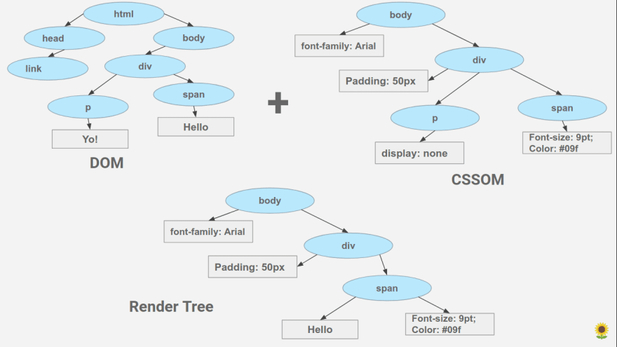

# Assignment 1

The main function of a browser is to present the web resource you choose, by requesting it from the server and displaying it in the browser window. The resource is usually an HTML document, but may also be a PDF, image, or some other type of content. The location of the resource is specified by the user using a URI (Uniform Resource Identifier). The way the browser interprets and displays HTML files is specified in the HTML and CSS specifications maintained by W3C Organisation.

## High-Level Components of Web Browsers

The browsers high level structure includes:

1. The user interface - includes the address bar, back button, refresh button, forward button, menu etc.
2. The browser engine - coordinates between the UI and the rendering engine.
3. The rendering engine - responsible for displaying the requested content.
4. Javascript engine - is used to interpret and parse javaScript Code.
5. Data Storage - all storage mechanisms like localStorage, IndexedDB, WebSQL etc.
6. Other structures.

### The User Interface.

The user interface is of the browser majorly consists of the following:

1. The viewport: This is the area of the browser inside which the requested webpage is displayed.
2. Back Button: This button is used to go back to the previous page.
3. Forward Button: This button is used by users to go forward to the next page viewed earlier.
4. Refresh Button: This button is used to refresh the page. Upon pressing the Refresh Button, a fresh request is sent to the server and the same page is reloaded with latest details.
5. The address bar: This is the area of the UI which displays the web address of the page that is displayed.
6. Tab List: This is the area which displays the tabs opened by the user.
7. Developer Tools: Most browsers have developer tools which can be opened using shortcuts (eg. Ctrl + shift + j) in Chrome Browser.

### The Browser Engine:

The Browser engine works as a bridge between the User Interface and the rendering engine. It queries and manipulates the rendering engine, according to the inputs from various user interfaces.

### The Rendering Engine:

The function of the rendering engine is display of the requested contents on the browser screen, which is termed as "rendering". By default the rendering engine can display HTML and XML documents and images. Different browsers use different rendering engines: Internet Explorer uses Trident, Firefox uses Gecko, Safari uses WebKit. Chrome and Opera (from version 15) use Blink, a fork of WebKit.

The rendering engine gets the contents of the requested document from the networking layer. Then the following steps are followed in sequence:

1. HTML is parsed to create the DOM (Document Object Model) Tree and CSS is parsed to create the CSSOM (Cascading Style Sheet Object Model) Tree.

   Parsing is nothing but analysing and converting a program or text into an internal format that a runtime environment can actually run. In other words, it simply means translating text/code/data into a structure that can be used by code for some purpose.

   Parsing involves Lexical Analysis and Syntax Analysis. Lexical Analysis is done by Lexers or Tokenisers which creates (upon request from the parser) tokens which are smallest elements which a parser can use.

   The Parser receives tokens from the Lexers, conducts syntax analysis and applies the syntax rules. After application of the syntax rules, the DOM Tree is created.

   The CSS is also parsed in a similar fashion and the CSSOM Tree is created.

2. The Render Tree is created by merging the DOM Tree and the CSSOM Tree. The Render Tree is a tree of styled DOM Nodes i.e. boxes complete with their cosmetic charateristics of color, dimensions etc.

3. Once the render tree is built, layout becomes possible. Layout is dependent on size of screen. This step determines where and how the elements are positioned on the page, determining the height and width of each element and where they are in relation to each other.

4. Once the render tree is created and the layout occurs, the pixels can be painted to the screen. On load, the entire screen is painted. After that, only the impacted areas are repainted.

### Networking:

This is the component of the browser retrieves the URLs using common internet protocols of HTTP or FTP. THe newtworking component handles all aspects of the Internet Communication and security. THe networking component may implement a cache of retrieved documents in order to reduce network traffic.

### JavaScript Interpreter

This is the compoenent of the web browser which interprets and executes the javascript code embedded in the website. The interpreted results are sent to the rendering engine for display. If the script is external, then first the resource is fetched from the network. The Parser keeps on hold until the script is executed.

### UI Backend

The UI backend is used for dewaing basic widgets like combo boxes and windows. THis backend exposes a generic interface that is ot platform specific. Under the hood, it uses the operating system user interface methods.

### Data Persistence/Storage

This is a persistence layer. Browsers support storage mechanisms like localStorage, IndexedDB, WebSQL and fileSystem. It is a small database created on the local drive of the computer where the browser is installed. It manages user data such as cache, cookies, bookmarks and preferences.

## Order of Script Processing

When a broser loads HTML and comes across  tag, it cannot continue building the DOM. It must execute (download and execute if the script has <code>src</code> attribute) the script immediately. The browser must execute the script and then it can proceed to process rest of the page.

This leads to two important issues:

1. Scripts cant see the DOM elements below them and they cannot add handlers etc.
2. If the script is bulky, users cannot see the page the script is downloaded and executed.

One solution is to add the scripts at the very end of the boady tag. But this solution is not perfect. THe better solution to handle this problem is to use the <code>defer</code> and <code>async</code> attributes in the script tag.

### <code>defer</code> Attribute

The <code>defer</code> attribute makes the browser not to wait for the script. Instead the browser will continue to process t he HTML and build the DOM. THe script loads in the background and runs when the DOM is fully built.

In other words:

1. script tags with <code>defer</code> attribute will not block the page.
2. script tags with <code>defer</code> attribute will execute when the DOM is ready (but before the <code>DOMContentLoaded</code> event).

This results in page content immediatly showing up.

Deferred scripts keep their relative order, just like regular scripts.

### <code>async</code> Attribute

The <code>async</code> attribute is somewhat like defer. It also makes the script non-blocking. But it has important differences in the behavior.

The <code>async</code> attribute is somewhat like <code>defer</code>. It also makes the script non-blocking. But it has important differences in the behavior.

The <code>async</code> attribute means that a script is completely independent:

1. The browser doesn’t block on <code>async</code> scripts (like defer).
2. Other scripts don’t wait for <code>async</code> scripts, and <code>async</code> scripts don’t wait for them.

## References:

1. [Kruno: How browsers work | JSUnconf 2017](https://www.youtube.com/watch?v=0IsQqJ7pwhw)
2. [Learn About Parsing - What is it and Why Do You Need It?](https://www.youtube.com/watch?v=T0BO415l3N0)
3. [Notes on “How Browsers Work”](https://codeburst.io/how-browsers-work-6350a4234634)
4. [How browsers work](https://web.dev/howbrowserswork/)
5. [What happens when you type a URL in the browser and press enter?](https://medium.com/@maneesa/what-happens-when-you-type-an-url-in-the-browser-and-press-enter-bb0aa2449c1a)
6. [HTML parsing and rendering](https://dev.to/saurabhdaware/html-parsing-and-rendering-here-s-what-happens-when-you-type-url-and-press-enter-3b2o)
7. [How web browsers work - parsing the CSS](https://dev.to/arikaturika/how-web-browsers-work-parsing-the-css-part-4-with-illustrations-4c)
8. [How does web browsers work?](https://medium.com/@monica1109/how-does-web-browsers-work-c95ad628a509)
9. [Critical rendering path - Crash course on web performance (Fluent 2013)](https://www.youtube.com/watch?v=PkOBnYxqj3k)
10. [High Performance JavaScript by Nicholas C. Zakas - Loading and Execution](https://www.oreilly.com/library/view/high-performance-javascript/9781449382308/ch01.html)
11. [Scripts: async, defer](https://javascript.info/script-async-defer)

12. [How Browsers Load and Process JavaScript](https://www.innoq.com/en/blog/loading-javascript/)

13. [Dom Parser](https://www.youtube.com/watch?v=mW34Gc9c6JY)

