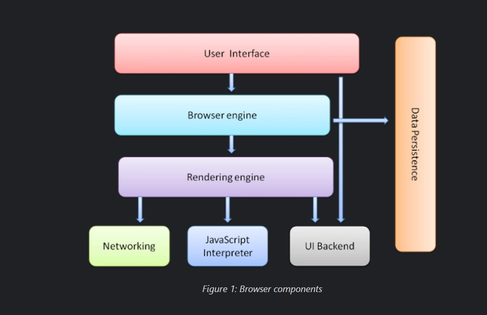

# Assignment 1

The main function of a browser is to present the web resource you choose, by requesting it from the server and displaying it in the browser window. The resource is usually an HTML document, but may also be a PDF, image, or some other type of content. The location of the resource is specified by the user using a URI (Uniform Resource Identifier). The way the browser interprets and displays HTML files is specified in the HTML and CSS specifications maintained by W3C Organisation.

The browsers high level structure includes:
1. The user interface - includes the address bar, back button, refresh button, forward button, menu etc.
2. The browser engine - coordinates between the UI and the rendering engine.
3. The rendering engine - responsible for displaying the requested content.
4. Javascript interpreter - is used to interpret and parse javaScript Code.
5. Data Storage - all storage mechanisms like localStorage, IndexedDB, WebSQL etc.
6. Other structures.

.

## The Rendering Engine:
The function of the rendering engine is display of the requested contents on the browser screen, which is termed as "rendering". By default the rendering engine can display HTML and XML documents and images. Different browsers use different rendering engines: Internet Explorer uses Trident, Firefox uses Gecko, Safari uses WebKit. Chrome and Opera (from version 15) use Blink, a fork of WebKit.

The rendering engine gets the contents of the requested document from the networking layer.

